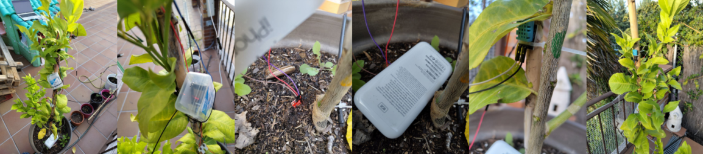
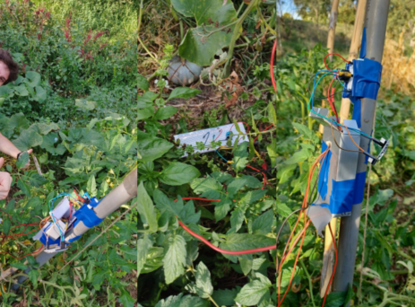
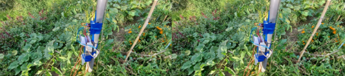
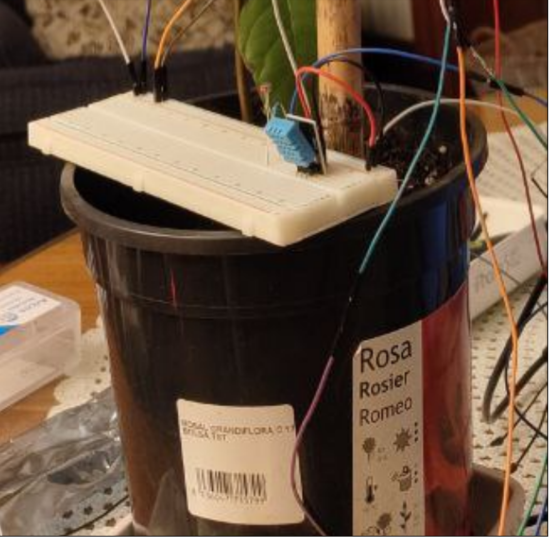
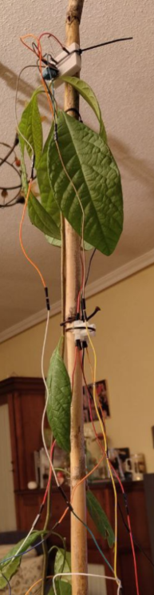

# Garden timeseries

Data has been manually gathered with a timelapse of 30s. There are missing readings of sensors and ground moisture sensor brokes after X time, so some preprocessing is needed.

This project's goal is to achieve more sustainable and efficient agricultural practices by enhancing irrigation efficiency. For this, we seek to predict moisture conditions with Machine Learning techniques, in order to guarantee optimal watering schedules, adapted to the specific needs of each plant. This approach not only conserves water by preventing over-irrigation but also ensures that plants receive the right amount of moisture at the right time, promoting healthier growth and reducing resource waste.

We decided to gather our own data from plants. We contacted *[Colectivo Kybele](https://www.etsiaab.upm.es/Estudiantes/Futuros%20Alumnos/Asociaciones_ETSIAAB?fmt=detail&prefmt=articulo&id=e5e6a18f18f7e510VgnVCM10000009c7648a____)*, a student organization from UPM's ETSIAAB, who kindly allowed us to place sensors in their garden. We placed sensors both in an indoor home plant, and in one of Kybele's tomato plants, growing outdoors.
We used several sensors to collect the data, which we connected to an ESP32, connected via WI-FI to the eudoroam network. The network bandwith was rather low from the garden, so we encountered missing values on the data we collected.

The sensors were set up so they would output information in 30-second intervals, directly into Google Sheets. However, due to the unstable WI-FI connection, the infrastructure created for the outdoors garden wasn't fully prepared and some sensors suffered from overheating, so they didn't fully work as expected. The data was not as good as it could have been, plus some newly-purchased components like the SD card started malfunctioning aswell. The solution to this was to use an 8 month avocado plant indoors and meassuring the values in a more controlled environment. The whole process took around two weeks to be completed.

Each plant (tomato plant, lemon tree and avocado plant) was equipped with the following sensors:

* **Moisture sensor** to meassure the level of water on the ground.
  * The moisture sensor started working erratically because it was damaged, and it can be seen on the charts. For this reason, a rolling mean for training and prediction.
* Two **DHT sensors** for humidity and temperature. One for the top of the tree and the other for the ground.
* **Sunlight sensors** to gather the amount of sun on the top and bottom of the plant.
  * Bad decision because the bought sensors gave relative sunlight data.

## Lemon tree deployment



## Tomato plant




## Avocado plant




## Requirements

* ydata_profiling
* pandas
* numpy
* matplotlib
* statsmodels
* keras 2.12.0
* sklearn

##  Folder structure is organized as follows

```txt
├── README.md
├── embedded_software
│   └── garden
│       ├── CMakeLists.txt
│       ├── app
│       │   ├── CMakeLists.txt
│       │   ├── include
│       │   │   └── FreeRTOSConfig.h
│       │   └── main.c
│       ├── freertos
│       │   ├── CMakeLists.txt
│       │   └── FreeRTOSConfig.h
│       ├── pico_sdk_import.cmake
│       └── scripts
│           ├── open_vscode.sh
│           ├── run.sh
│           └── start_project.sh
├── imgs
│   ├── avocado_plant_0.png
│   ├── avocado_plant_1.png
│   ├── limonero.png
│   ├── tomato_plant_0.png
│   └── tomato_plant_1.png
├── notebooks
│   ├── EDA.ipynb
│   ├── ensemble.ipynb
│   ├── models.ipynb
│   ├── preprocessing.ipynb
│   └── utils.py
└── time_series_gardeen_report.html
```

## Code structure

* `Notebooks`
  * `EDA.ipynb` generates a description on data.
  * `preprocessing.ipynb` generates a new csv to train the model.
  * `models.ipynb` contains some initial baseline model tests.
  * `ensemble.ipynb` contains the development of the final ensemble model.

* `Embedded software` contains the code which operates the sensors and makes them post data.